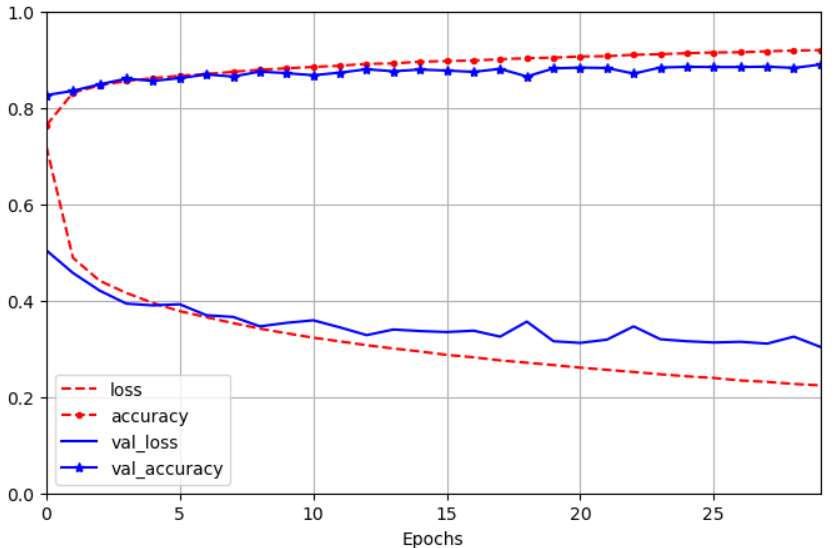
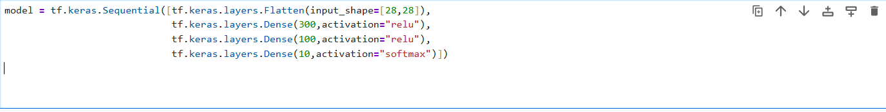

# keras-with-image-classification
📌 Image Classification with Keras  This project demonstrates an image classification model built using Keras (with TensorFlow backend). The goal is to train a deep learning model that can automatically recognize and classify images into predefined categories.


## 🔹 Model Architecture

```python
model = tf.keras.Sequential([
    # Input Layer
    # Flattens 28x28 images into a 784-dimensional vector
    tf.keras.layers.Flatten(input_shape=[28,28]),

    # Hidden Layer 1
    # Fully connected layer with 300 neurons and ReLU activation
    tf.keras.layers.Dense(300, activation="relu"),

    # Hidden Layer 2
    # Fully connected layer with 100 neurons and ReLU activation
    tf.keras.layers.Dense(100, activation="relu"),

    # Output Layer
    # Fully connected layer with 10 neurons (for 10 classes)
    # Softmax activation outputs probability distribution
    tf.keras.layers.Dense(10, activation="softmax")
])
```
# 📌 Image Classification with Keras


---

## 🔹 Key Features
- Implemented with **Keras Sequential API** for simplicity and flexibility  
- Uses **Convolutional Neural Networks (CNNs)** for feature extraction  
- Trains on image datasets and validates model performance  
- Includes **data augmentation** to improve generalization  
- Provides **accuracy/loss visualization** during training  

---

## 🔹 Workflow
1. **Data Preprocessing**: Images are resized, normalized, and split into training and validation sets  
2. **Model Architecture**: A CNN model is built with convolution, pooling, dropout, and dense layers  
3. **Training**: The model is trained using categorical cross-entropy loss and an optimizer like Adam  
4. **Evaluation**: Performance is evaluated on test data with metrics like accuracy  
5. **Prediction**: The trained model can classify new, unseen images  

---

## 🔹 Example Applications
- Handwritten digit recognition (**MNIST**)  
- Object classification (**CIFAR-10, ImageNet subsets**)  
- **Medical image analysis**  
- **Real-time image recognition** in applications  

---
